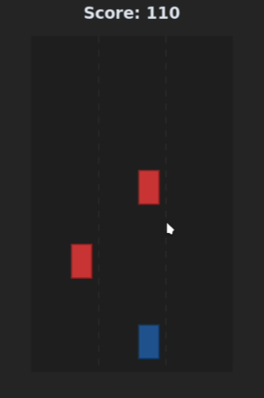

# Termux Runner

An endless runner game engineered specifically for the constraints of Termux X11/XFCE4 environments. Built strictly with Python 3 and `CustomTkinter`.

## Screenshots

## Features
* **Native Termux Aesthetics:** Follows a strict dark mode color palette native to CustomTkinter.
* **Lightweight GUI:** Avoids heavy rendering layers (like PyGame or OpenGL) to prevent X11 rendering glitches (the dreaded "white window" bug) in Termux `proot` systems.
* **Progressive Difficulty:** Speed scales dynamically as your score increases.

## Controls
* **Left Arrow Key:** Move player left.
* **Right Arrow Key:** Move player right.

## Installation / Uninstallation
* Run `./install.sh` to install dependencies, generate the icon, and integrate it into your XFCE4 application menu.
* To remove the application cleanly from your system, execute the `./uninstall.sh` script located in `~/.local/opt/termux-runner/`.

*(Note: Thunar custom actions are omitted as this application is a game and does not process file inputs).*